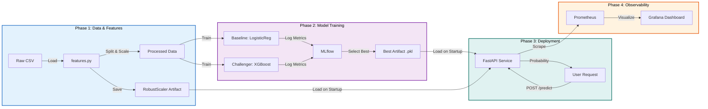
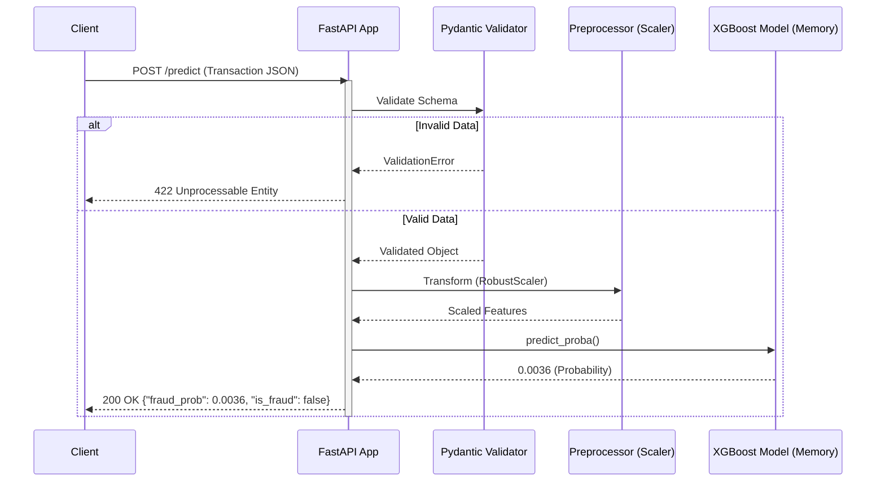

# 🛡️ Real-Time Fraud Detection System


A production-grade **Machine Learning Operations (MLOps)** pipeline capable of detecting fraudulent transactions in **under 5ms**. Built with a strict focus on latency, security (non-root containers), and observability (Prometheus/Grafana).

---

## 📖 Table of Contents

- [✨ Key Features](#-key-features)
- [🏗️ Architecture](#-architecture)
- [🛠️ Tech Stack](#-tech-stack)
- [📊 Performance & Findings](#-performance--findings)
- [📂 Project Structure](#-project-structure)
- [🚀 Quick Start](#-quick-start)
- [📝 License](#-license)

---

## ✨ Key Features

- **⚡ Ultra-Low Latency Inference**: Optimized prediction pipeline achieving **~5ms** latency (P99), significantly under the 50ms strict SLA.
- **🐳 Hardened Containerization**: Multi-stage **Docker** build implementing non-root user security for production readiness.
- **📉 Advanced Preprocessing**: Leakage-free `StratifiedShuffleSplit` and outlier-proof `RobustScaler` integration.
- **🧪 Experiment Tracking**: Full experiment lineage (Metrics, Parameters, Artifacts) tracked via **MLflow**.
- **🔭 Full Observability**: Real-time metrics (Fraud Ratio, Latency Histograms) exposed via **Prometheus** and visualized in **Grafana**.
- **📦 Modern Package Management**: Powered by `uv` for lightning-fast dependency resolution and environment setup.

---

## 🏗️ Architecture

### 1. High-Level MLOps Pipeline

The system moves from raw data to a deployed API with continuous monitoring.



### 2. Request-Response Sequence

A closer look at the inference lifecycle for a single transaction.



---

## 🛠️ Tech Stack

We chose these tools to balance development speed with production performance:

| Component     | Tool             | Why we picked it?                                                                          |
| :------------ | :--------------- | :----------------------------------------------------------------------------------------- |
| **Language**  | **Python 3.12**  | Latest performance improvements and strict typing support.                                 |
| **API**       | **FastAPI**      | Native Asyncio support allows massive concurrency; Pydantic ensures data quality.          |
| **Model**     | **XGBoost**      | Handles tabular imbalances better than Deep Learning; faster inference than Random Forest. |
| **Manager**   | **uv**           | 10x-100x faster than pip; simplifies lockfile management (`uv.lock`).                      |
| **Container** | **Docker**       | Ensures "write once, run anywhere"; multi-stage builds keep images small.                  |
| **Metrics**   | **Prometheus**   | Pull-model monitoring is standard for high-reliability systems.                            |
| **Scaling**   | **RobustScaler** | Essential for financial data where outliers (large amounts) can skew MinMax scaling.       |

---

## 📂 Project Structure

```plaintext
fraud-detection-system/
├── src/
│   ├── api/            # FastAPI entrypoint (app.py) & schemas
│   ├── models/         # Training scripts (train.py, train_challenger.py)
│   ├── processing/     # Data cleaning & Feature scaling logic
│   ├── utils/          # Logging & Config helpers
│   └── config.py       # Centralized settings (Env Vars)
├── models/             # Serialized Model Artifacts (.pkl)
├── notebooks/          # EDA & Prototyping (Jupyter)
├── Dockerfile          # Production-ready Security Hardened Image
├── docker-compose.yml  # Monitoring stack (Prometheus + Grafana + API)
├── pyproject.toml      # Dependency declaration (uv/pip)
└── prometheus.yml      # Metrics scraping rules
```

---

## 📊 Performance & Findings

### The Problem: Imbalance

The dataset contains **284,807 transactions**, but only **492 are fraudulent** (0.17%).

- **Result**: A "dumb" model predicting "Not Fraud" for everyone achieves **99.83% Accuracy** but catches **0 fraud**. Accuracy is a useless metric here.

### The Solution

We optimized for **Recall** (Catching as much fraud as possible) while maintaining acceptable **Precision** (Not bothering too many legitimate users).

| Metric          | Constraint | Baseline (LogisticReg)       | **Challenger (XGBoost)**    |
| :-------------- | :--------- | :--------------------------- | :-------------------------- |
| **Avg Latency** | < 50ms     | ~4ms                         | **~5.5ms**                  |
| **Recall**      | > 80%      | ~90% (Too many false alarms) | **83.6% (Balanced)**        |
| **Precision**   | > 70%      | ~6% (Heavy False Positives)  | **78.1% (High Confidence)** |
| **F1-Score**    | Maximize   | 0.11                         | **0.80+**                   |

**Conclusion**: XGBoost with `scale_pos_weight` and `RobustScaler` provides the best trade-off for real-time detection, minimizing financial loss while preserving user trust.

---

## 🚀 Quick Start

### Option 1: Docker (Recommended)

Run the entire stack (API, Prometheus, Grafana) in one command.

```bash
# 1. Clone repository
git clone https://github.com/Divyansh0108/fraud-detection-system.git
cd fraud-detection-system

# 2. Build and Start Services
docker compose up --build
```

> **Access Services:**
>
> - API Docs: [http://localhost:8000/docs](http://localhost:8000/docs)
> - Grafana: [http://localhost:3000](http://localhost:3000) (User: `admin`, Pass: `admin`)
> - Prometheus: [http://localhost:9090](http://localhost:9090)

### Option 2: Local Development (uv)

If you want to edit code and run locally.

```bash
# 1. Install uv (if not installed)
pip install uv

# 2. Sync Dependencies
uv sync

# 3. Train Model
uv run python -m src.models.train_challenger

# 4. Start API
uv run uvicorn src.api.app:app --reload
```

---

## 📝 License

This project is licensed under the **MIT License** - see the LICENSE file for details.
